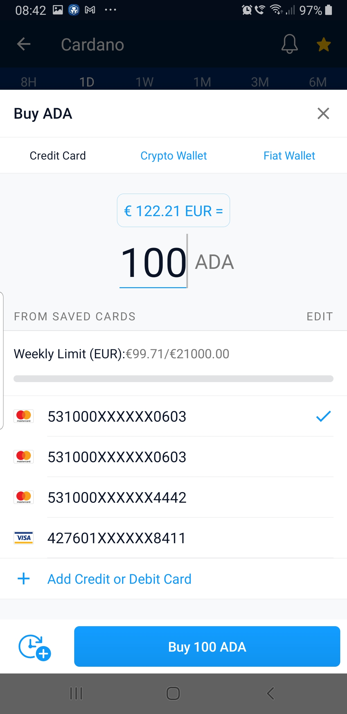

# How to buy and sell crypto for Dummies

So you would like to Buy Cardano $ADA or other crypto currency and you don't know where to begin? These step by step instructions are for you! You have many different choices where to buy or sell crypto currency. However,  in this tutorial, I will be providing you with links and instructions on how to buy with some of the worlds largest exchanges like crypto.com and Binance.


Tip!  Surely you can download the programs on your own and just register, but this way you will not be getting extra perks. Exchanges like Crypto.com and Binance are interested in spreading a word about crypto, so they give referral bonus for every person who signs up. Both parties, the one who refers and the one who signs up, both get a bonus! So I encourage you to sign up using my links below. After you register and you claim your reward you will be able to refer your friends and you and your friend will receive a bonus. Much better than just signing up on your own and leaving money on the table!


####  Buying and selling crypto with Crypto.com

 Use my referral link [https://crypto.com/app/phupcmyyct](https://crypto.com/app/phupcmyyct) to sign up for Crypto.com and we both get $25 USD

Exchanges are like a bank. Its an organization that lets you buy and sell crypto so in order to make any transactions and for exchanges to stop any fraudulent activity, they have to verify your identity so you will need an official ID or a Passport. It is completely safe to share this information with exchanges like crypto.com and Binance. 

It is better to click on the link above from your smart phone and register using your phone, because you will have to make a picture of your ID using the app. Once you register and your application is approved \(by the way it took me several tries to submit my ID\) It was turned down because lighting was not good or parts of the ID were not readable. During the registration you will be provided with key words - it is usually 24 words, make sure to write down those words and store them in a safe place.


Tip!  When you go to a bank they verify your identity using your ID from now on in the crypto world your identity will be verified using these 24 words! When you hear horror stories that somebody lost access to their crypto is only because they either lost those key fraises or somebody stole them! 


Once your application is approved you will be able to log into your app. your main screen will look something like this. You will want to click on the ctypto.com logo at the bottom of the screen

Your screen will look like this:

Now click on buy at the bottom of the screen and you will have an option to purchace a range of crypto currencies

In order for you to get the 25$ bonus you will need to purchase crypto.com-s tocken CRO \(you can then sell it\). In the search where it says cryptocurrency you can tap and type in CRO or just select it from the list.  Once you select the cryptocurrency you will be taken to the checkout box, where you will select the amount that you want to spend. Just click on CRO and change quantity, you will see what that transaction will cost you in your selected currency, for me it is EUR.

Since I buy Crypto regularly, I already have several credit cards added. You will need to click on Add credit card to add your first card. Here everything is straight forward! After you added your card you will click on buy ADA and its going to take you to the confirmation page. 

\*\*\*\*🥳 **You are done! Congratulations on buying your first Crypto currency!**

