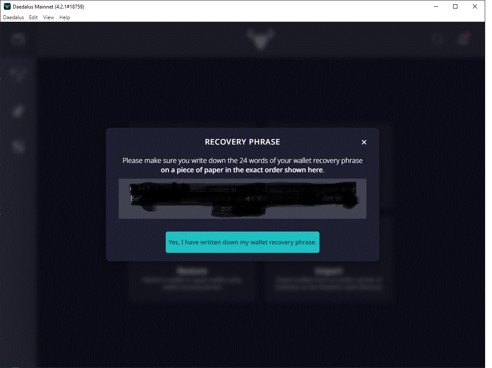

# How to download and create your ADA wallet

You can delegate ADA to a stake pool like ours TRGT using Daedalus in a few quick and easy steps.

The proof of stake protocol allows users to be rewarded in ADA for helping to validate blocks on the network, similar to how Bitcoin and Ethereum validate their networks with mining, rewarding miners in their respective tokens.

The process of staking is easy and risk free.

Users that are holding ADA can simply load a wallet using Daedalus or other popular Cardano wallets such as Yoroi, delegate ADA to a Stake Pool and receive rewards in the process.

You can follow these easy steps to get started with delegating your ADA to a Stake Pool. In this tutorial we will be using a Daedalus wallet. Daedalus is a full node wallet. This means that unlike light wallets \(e.g.Yoroi, Adalite etc.\) Daedalus downloads a full copy of the Cardano blockchain and independently validates every transaction in its history. That way you get maximum security and completely trustless operation, without centrally hosted 3rd party servers.

### Download, Install & Create a Daedalus Wallet

From this link [https://daedaluswallet.io/](https://daedaluswallet.io/)

Download the executable file and run it

Click install

After installation has finished a link to daedalus will be created on your Desktop. Double click it. You will see the following.

Click continue and agree with terms of service.

Click on create a new wallet

Name your wallet and set a secure password

Create a secure password

on the next screen you will be given a recovery passphrase. DO NOT LOOSE IT! THIS IS THE ONLY WAY TO LOOSE ACCESS TO YOUR MONEY if your computer breaks or gets stolen, you will not be able to restore your wallet!

Congratulations your wallet is created and now you can transfer your ADA into it that you have purchased on an Exchange \([Please use our guide on how to purchase your first ADA](https://instructions.target-pool.com/v/english/general-crypto/how-to-buy-and-sell-crypto-for-dummies)\)

Now your wallet will synch the blockchain, this will take a while.

