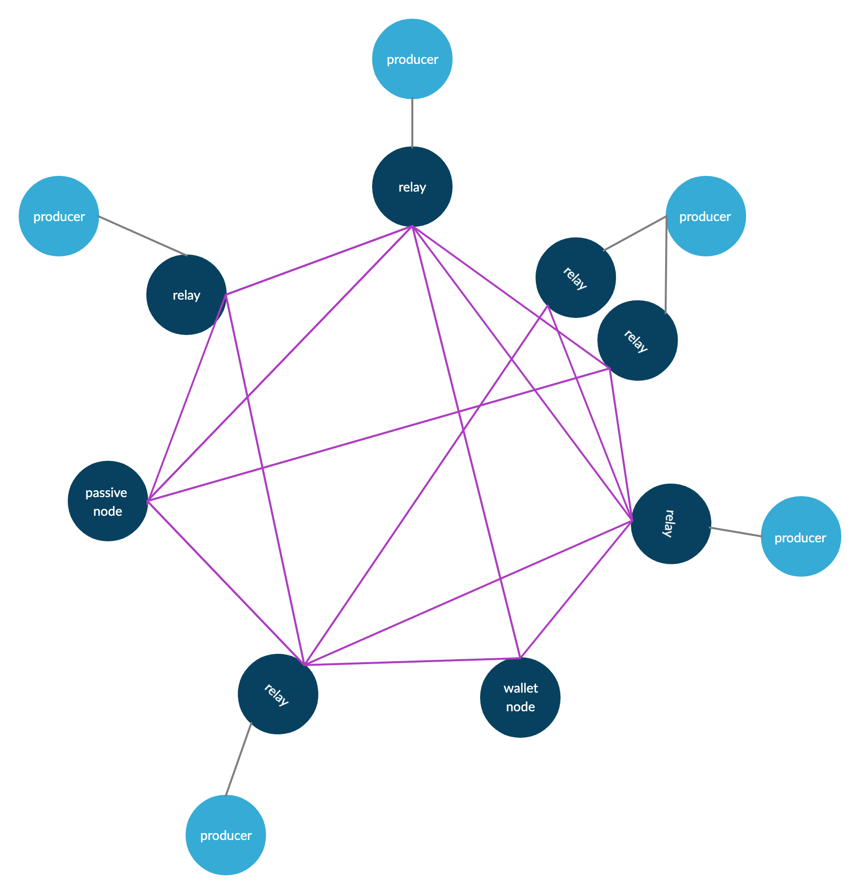

# Cardano Node Installation Guide 1.26.1

Cardano Node Installation Guide 1.25.1 \(MainNet\) for Dummies.

1\) This guide assumes that you have at least a basic knowledge of Linux administration. 2\) We will use Ubuntu as our operating system of choice.

also excellent resources on the Internet Cardano Community Technical Support [https://t.me/CardanoCommunityTechSupport](https://t.me/CardanoCommunityTechSupport)

This guide is based on the official Cardano guide and our experience. I realize that there is a lot of scattered information on the internet, so I created this guide where you can find everything in one place. Your setup should have at least 2 servers and a standalone machine, ideally 3 servers and a standalone computer \(1 PSU, 2 relays and a standalone computer\)

